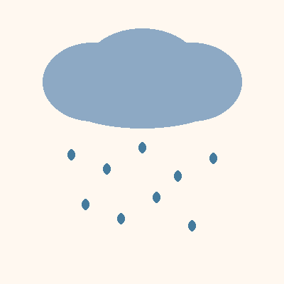
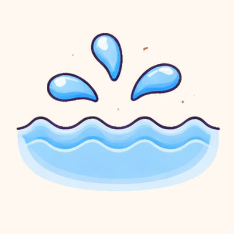

# Image Sources

This file tracks the source, copyright status, and generation details for all images in `images/`.

**Note:** Personal/private images (family photos etc.) never go in this repo; they live in a private deck repo alongside its `deck.csv`.

**Post-processing (2026-07):** all 34 images had their backgrounds normalized to exactly `#FFF8F0` (the card cream) so they blend into the picture card; `zon.png` additionally had a white border stripe flood-filled away, and `banaan.png`/`bal.png` had residual background mottling flattened by border flood-fill (2026-07-04).

## House style — "Zebra–Nijntje–Ghibli"

Three anchors define the style; every new pictogram must honor all three:

- **Zebra** — the concrete reference set: **zebra.png, beer.png, appel.png, auto.png**.
  New art must sit next to these on a printed page without looking foreign: same outline
  weight, palette warmth, shading softness.
- **Nijntje** — radical simplicity: one subject, chubby rounded shapes, nothing a toddler
  can't name. If a detail doesn't help a two-year-old recognize the word, it goes.
- **Ghibli** — the warmth: soft light, gentle shading, storybook innocence. Never flat
  clip-art, never plasticky 3D, never cold.

Spelled out as rules:

- **One subject, no scene.** Centered, filling ~70–75% of the square. One word = one thing;
  no props or background elements to point at instead.
- **Chubby, rounded, simplified.** Recognizable from its silhouette alone — cards print at
  ~5 cm, and a toddler should be able to name it across the table.
- **Thick, soft, dark-brown outline** (warm near-black, not pure black), rounded everywhere.
- **Warm saturated colors with soft cel shading**: a base tone, one darker shade, a small
  gloss highlight; light from the top left.
- **Faces on animals only** — dot eyes, blush cheeks. Objects stay faceless.
- **Flat cream `#FFF8F0` background** with one soft warm shadow ellipse under the subject.
- **Never any text, letters, borders, or patterned backgrounds** — the card layout provides
  the word and the frame.

### Master generation prompt

Attach 2–3 of the reference images, then:

> Children's book illustration of **[WORD]**, exactly matching the style of the attached
> reference images: cute, chubby rounded shapes, thick soft dark-brown outlines, warm
> saturated colors with soft gentle shading and a small gloss highlight, light from the
> top left, storybook warmth like a Studio Ghibli still,
> **[minimal cute face with blush cheeks | no face — it is an object]**, a single subject
> centered on a plain cream `#FFF8F0` background filling about three quarters of the frame,
> small soft shadow underneath, no text, no border. Square image.

### Acceptance criteria for new cards

A generated image enters the deck only if it passes all five:

1. **Not foreign:** side-by-side with zebra/beer/appel — same outline weight, shading
   softness, and warmth.
2. **Simple:** one subject, no scene, silhouette alone is recognizable.
3. **Learnable:** passes the squint test at 3 cm, and is not confusable with another word
   already in the deck.
4. **Technical:** square, ≥ 400×400, background flood-fills cleanly to `#FFF8F0`, no text
   or border baked in.
5. **Recorded:** a row in the table below with source, date, and the prompt used.

## License Types

- **ChatGPT/DALL-E**: Per OpenAI's terms, users own the images they create and can use them commercially.
- **Pillow placeholder**: Self-created geometric shapes, no copyright restrictions.

## Images

| Preview | Name | Source | Date | Prompt |
|:-------:|------|--------|------|--------|
|  | appel | ChatGPT/DALL-E | 2026-03-19 | |
|  | auto | ChatGPT/DALL-E | 2026-03-19 | |
|  | bad | Pillow placeholder | | |
|  | bal | ChatGPT/DALL-E | 2026-03-19 | Create a 3x1 grid of cute, simple, child-friendly illustration style similar to Dutch children's books like Nijntje (Miffy) or Dikkie Dik. Soft rounded shapes, warm colors, gentle outlines, cream/beige background. The style should be appealing to toddlers (age 2). The 3 items to draw (left to right, top to bottom): banaan, beer, bal. Each item should be in its own cell with a cream/beige background. Keep items centered and recognizable for a toddler. |
|  | banaan | ChatGPT/DALL-E | 2026-03-19 | Create a 3x1 grid of cute, simple, child-friendly illustration style similar to Dutch children's books like Nijntje (Miffy) or Dikkie Dik. Soft rounded shapes, warm colors, gentle outlines, cream/beige background. The style should be appealing to toddlers (age 2). The 3 items to draw (left to right, top to bottom): banaan, beer, bal. Each item should be in its own cell with a cream/beige background. Keep items centered and recognizable for a toddler. |
|  | beer | ChatGPT/DALL-E | 2026-03-19 | Create a 3x1 grid of cute, simple, child-friendly illustration style similar to Dutch children's books like Nijntje (Miffy) or Dikkie Dik. Soft rounded shapes, warm colors, gentle outlines, cream/beige background. The style should be appealing to toddlers (age 2). The 3 items to draw (left to right, top to bottom): banaan, beer, bal. Each item should be in its own cell with a cream/beige background. Keep items centered and recognizable for a toddler. |
|  | boom | Pillow placeholder | | |
|  | deur | ChatGPT/DALL-E | 2026-03-19 | |
|  | draak | ChatGPT/DALL-E | 2026-03-19 | |
|  | druif | ChatGPT/DALL-E | 2026-03-19 | |
|  | eend | ChatGPT/DALL-E | 2026-03-19 | |
|  | fiets | ChatGPT/DALL-E | 2026-03-19 | |
|  | hand | Pillow placeholder | | |
|  | huis | Pillow placeholder | | |
|  | jas | Pillow placeholder | | |
|  | kat | ChatGPT/DALL-E | 2026-03-18 | |
|  | koe | ChatGPT/DALL-E | 2026-03-18 | |
|  | leeuw | ChatGPT/DALL-E | 2026-03-18 | |
|  | melk | Pillow placeholder | | |
|  | muis | Pillow placeholder | | |
|  | neus | Pillow placeholder | | |
|  | olifant | ChatGPT/DALL-E | 2026-03-18 | |
|  | oog | ChatGPT/DALL-E | 2026-03-22 | Create a cute, simple, child-friendly illustration style similar to Dutch children's books like Nijntje (Miffy) or Dikkie Dik. Soft rounded shapes, warm colors, gentle outlines, pure white (#FFFFFF) background. The style should be appealing to toddlers (age 2). No text, labels, or captions in the image. Draw: oog. Make it centered on a cream/beige background, simple and recognizable for a toddler. |
|  | peer | Pillow placeholder | | |
|  | regen | Pillow placeholder | | |
|  | schoen | Pillow placeholder | | |
|  | sok | Pillow placeholder | | |
|  | tafel | Pillow placeholder | | |
|  | tand | Pillow placeholder | | |
|  | vis | Pillow placeholder | | |
|  | vlinder | Pillow placeholder | | |
|  | water | ChatGPT/DALL-E | 2026-03-19 | |
|  | zebra | ChatGPT/DALL-E | 2026-03-18 | |
|  | zon | ChatGPT/DALL-E | 2026-03-19 | |
