# Image Sources

This file tracks the source, copyright status, and generation details for all images in `images/`.

**Note:** Personal/private images (family photos etc.) never go in this repo; they live in a private deck repo alongside its `deck.csv`.

**Post-processing (2026-07):** all 34 images had their backgrounds normalized to exactly `#FFF8F0` (the card cream) so they blend into the picture card; `zon.png` additionally had a white border stripe flood-filled away, and `banaan.png`/`bal.png` had residual background mottling flattened by border flood-fill (2026-07-04).

## House style — "Zebra–Nijntje–Ghibli"

Three anchors define the style; every new pictogram must honor all three:

- **Zebra** — the concrete reference set: **zebra.png, beer.png, appel.png, auto.png**.
  New art must sit next to these on a printed page without looking foreign: same outline
  weight, palette warmth, shading softness.
- **Nijntje** — radical simplicity: one subject, chubby rounded shapes, nothing a toddler
  can't name. If a detail doesn't help a two-year-old recognize the word, it goes.
- **Ghibli** — the warmth: soft light, gentle shading, storybook innocence. Never flat
  clip-art, never plasticky 3D, never cold.

Spelled out as rules:

- **One subject, no scene.** Centered, filling ~70–75% of the square. One word = one thing;
  no props or background elements to point at instead.
- **Chubby, rounded, simplified.** Recognizable from its silhouette alone — cards print at
  ~5 cm, and a toddler should be able to name it across the table.
- **Thick, soft, dark-brown outline** (warm near-black, not pure black), rounded everywhere.
- **Warm saturated colors with soft cel shading**: a base tone, one darker shade, a small
  gloss highlight; light from the top left.
- **Faces on animals only** — dot eyes, blush cheeks. Objects stay faceless.
- **Flat cream `#FFF8F0` background** with one soft warm shadow ellipse under the subject.
- **Never any text, letters, borders, or patterned backgrounds** — the card layout provides
  the word and the frame.

### Master generation prompt

Attach 2–3 of the reference images, then:

> Children's book illustration of **[WORD]**, exactly matching the style of the attached
> reference images: cute, chubby rounded shapes, thick soft dark-brown outlines, warm
> saturated colors with soft gentle shading and a small gloss highlight, light from the
> top left, storybook warmth like a Studio Ghibli still,
> **[minimal cute face with blush cheeks | no face — it is an object]**, a single subject
> centered on a plain cream `#FFF8F0` background filling about three quarters of the frame,
> small soft shadow underneath, no text, no border. Square image.

### Word acceptance (checked before the image)

A word earns a card *before* any art is generated — a perfect pictogram can't rescue a
bad word, so these are checked first:

1. **Concrete and pointable.** A toddler can point at one and name it: no substances,
   weather, scenes, or abstractions. (`water` and `regen` were removed for exactly this —
   a splash and a rain cloud are concepts, not things a two-year-old points at.)

Only once a word passes here do the image acceptance criteria below apply.

### Acceptance criteria for new cards

A generated image enters the deck only if it passes all five:

1. **Not foreign:** side-by-side with zebra/beer/appel — same outline weight, shading
   softness, and warmth.
2. **Simple:** one subject, no scene, silhouette alone is recognizable.
3. **Learnable:** passes the squint test at 3 cm, and is not confusable with another word
   already in the deck.
4. **Technical:** square, ≥ 400×400, background flood-fills cleanly to `#FFF8F0`, no text
   or border baked in.
5. **Recorded:** a row in the table below with source, date, and the prompt used.

### Generation recipe (OpenAI images API)

Proven July 2026 (the 16-image batch below, ~$0.40 total):

- **Where:** engine-repo cloud sessions — `OPENAI_API_KEY` and `api.openai.com` are
  configured in this repo's environment. The family environment stays network-tight;
  pictograms for family decks are generated here and handed over.
- **Call:** `POST https://api.openai.com/v1/images/edits` (multipart form) with
  `model=gpt-image-1-mini`, `quality=medium`, `size=1024x1024`, `n=1`, the master
  prompt above as `prompt`, and `image[]=` zebra.png, beer.png, appel.png. The
  response carries base64 PNG in `data[0].b64_json`. Escalate to `gpt-image-1.5`
  only if mini can't hold the style (~$0.02 vs ~$0.06 per image, July 2026 prices).
- **Frozen anchors:** the reference images attached to every generation are permanently
  `zebra.png`, `beer.png`, `appel.png` — never a later image that was itself generated from
  them, so the style can't drift copy-of-a-copy across future batches.
- **Guardrails:** keep a per-session image cap (~25) and print a cost estimate per
  call; the platform key is prepaid with auto-recharge off, so the credit balance
  is the hard ceiling. Expect ~1.3 generations per accepted image (text sneaking
  into the image is the usual reason for a redo).
- **Intake:** `lettercards photo <raw.png> images/<word>.png --pictogram` — resizes
  to 400×400 and border-flood-fills the background to exact `#FFF8F0`. Then apply
  the acceptance criteria above and add a provenance row below.

## License Types

- **ChatGPT/DALL-E**: Per OpenAI's terms, users own the images they create and can use them commercially.
- **gpt-image (OpenAI API)**: Generated via the images API with reference images from this set attached; per OpenAI's terms, users own generated images.

## Images

| Preview | Name | Source | Date | Prompt |
|:-------:|------|--------|------|--------|
| 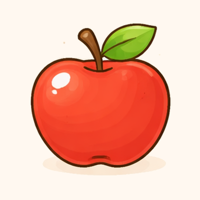 | appel | ChatGPT/DALL-E | 2026-03-19 | _prompt lost — regenerate from the master prompt if this image ever needs fixing_ |
| 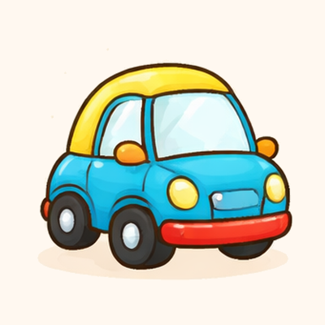 | auto | ChatGPT/DALL-E | 2026-03-19 | _prompt lost — regenerate from the master prompt if this image ever needs fixing_ |
|  | bad | gpt-image-1-mini | 2026-07-05 | master prompt, subject: "a bathtub with a few soap bubbles" (refs: zebra, beer, appel) |
| 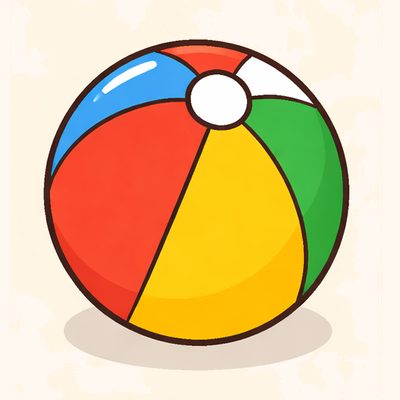 | bal | ChatGPT/DALL-E | 2026-03-19 | Create a 3x1 grid of cute, simple, child-friendly illustration style similar to Dutch children's books like Nijntje (Miffy) or Dikkie Dik. Soft rounded shapes, warm colors, gentle outlines, cream/beige background. The style should be appealing to toddlers (age 2). The 3 items to draw (left to right, top to bottom): banaan, beer, bal. Each item should be in its own cell with a cream/beige background. Keep items centered and recognizable for a toddler. |
| 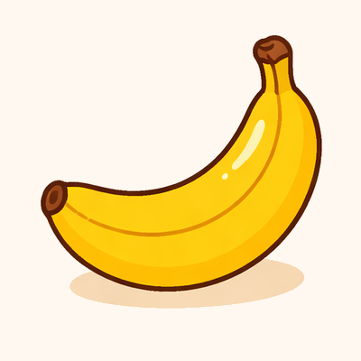 | banaan | ChatGPT/DALL-E | 2026-03-19 | Create a 3x1 grid of cute, simple, child-friendly illustration style similar to Dutch children's books like Nijntje (Miffy) or Dikkie Dik. Soft rounded shapes, warm colors, gentle outlines, cream/beige background. The style should be appealing to toddlers (age 2). The 3 items to draw (left to right, top to bottom): banaan, beer, bal. Each item should be in its own cell with a cream/beige background. Keep items centered and recognizable for a toddler. |
| 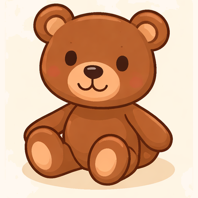 | beer | ChatGPT/DALL-E | 2026-03-19 | Create a 3x1 grid of cute, simple, child-friendly illustration style similar to Dutch children's books like Nijntje (Miffy) or Dikkie Dik. Soft rounded shapes, warm colors, gentle outlines, cream/beige background. The style should be appealing to toddlers (age 2). The 3 items to draw (left to right, top to bottom): banaan, beer, bal. Each item should be in its own cell with a cream/beige background. Keep items centered and recognizable for a toddler. |
| 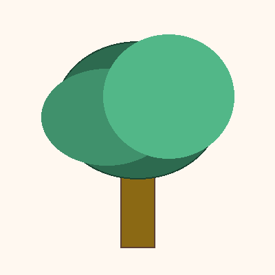 | boom | gpt-image-1-mini | 2026-07-05 | master prompt, subject: "a leafy green tree" (refs: zebra, beer, appel) |
| 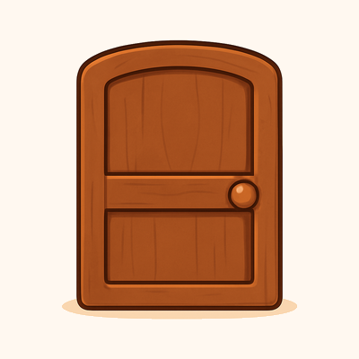 | deur | gpt-image-1-mini | 2026-07-06 | master prompt, subject: "a simple door" (refs: zebra, beer, appel) |
| 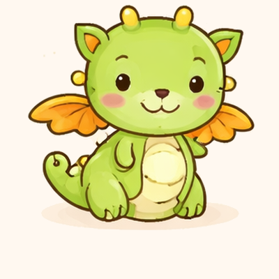 | draak | ChatGPT/DALL-E | 2026-03-19 | _prompt lost — regenerate from the master prompt if this image ever needs fixing_ |
| 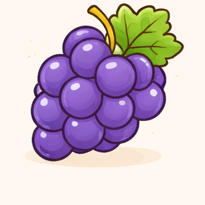 | druif | ChatGPT/DALL-E | 2026-03-19 | _prompt lost — regenerate from the master prompt if this image ever needs fixing_ |
| 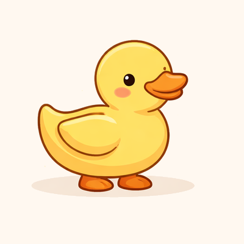 | eend | ChatGPT/DALL-E | 2026-03-19 | _prompt lost — regenerate from the master prompt if this image ever needs fixing_ |
| 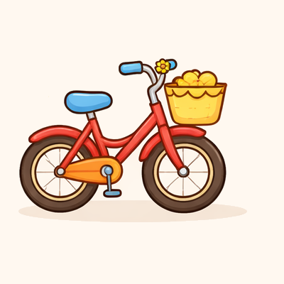 | fiets | ChatGPT/DALL-E | 2026-03-19 | _prompt lost — regenerate from the master prompt if this image ever needs fixing_ |
| 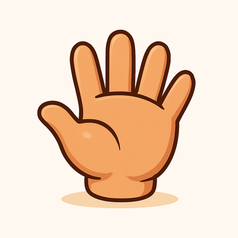 | hand | gpt-image-1-mini | 2026-07-05 | master prompt, subject: "an open child's hand, palm forward" (refs: zebra, beer, appel) |
| 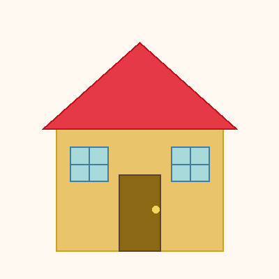 | huis | gpt-image-1-mini | 2026-07-05 | master prompt, subject: "a simple house with a red roof" (refs: zebra, beer, appel) |
| 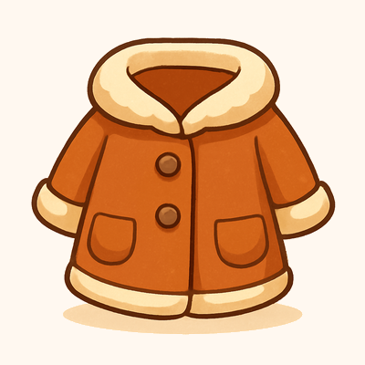 | jas | gpt-image-1-mini | 2026-07-05 | master prompt, subject: "a child's winter coat" (refs: zebra, beer, appel) |
| 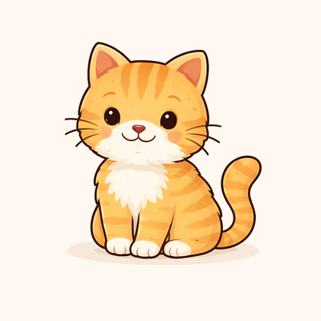 | kat | ChatGPT/DALL-E | 2026-03-18 | _prompt lost — regenerate from the master prompt if this image ever needs fixing_ |
| 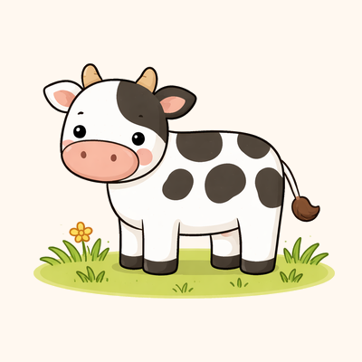 | koe | ChatGPT/DALL-E | 2026-03-18 | _prompt lost — regenerate from the master prompt if this image ever needs fixing_ |
| 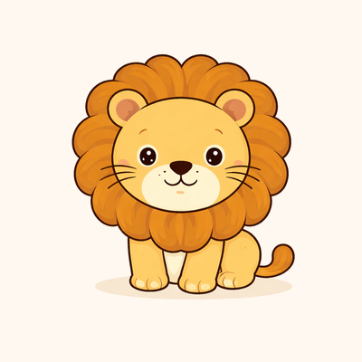 | leeuw | ChatGPT/DALL-E | 2026-03-18 | _prompt lost — regenerate from the master prompt if this image ever needs fixing_ |
| 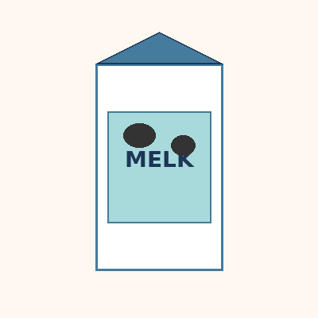 | melk | gpt-image-1-mini | 2026-07-05 | master prompt, subject: "a drinking glass of white milk next to an oat-milk carton with a blank label and glass pictogram (no text)" (refs: zebra, beer, appel) |
| 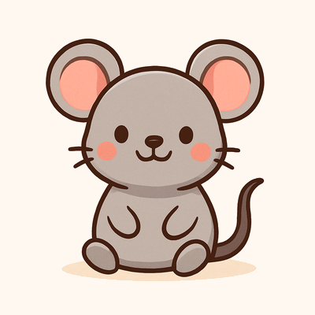 | muis | gpt-image-1-mini | 2026-07-05 | master prompt, subject: "a little grey mouse" (refs: zebra, beer, appel) |
| 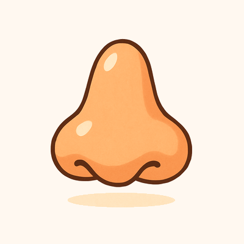 | neus | gpt-image-1-mini | 2026-07-05 | master prompt, subject: "a simple human nose" (refs: zebra, beer, appel) |
| 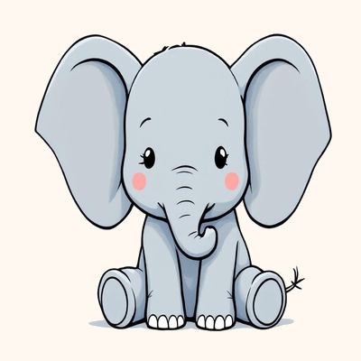 | olifant | ChatGPT/DALL-E | 2026-03-18 | _prompt lost — regenerate from the master prompt if this image ever needs fixing_ |
| 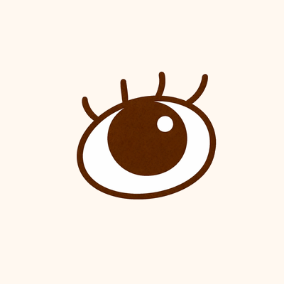 | oog | ChatGPT/DALL-E | 2026-03-22 | Create a cute, simple, child-friendly illustration style similar to Dutch children's books like Nijntje (Miffy) or Dikkie Dik. Soft rounded shapes, warm colors, gentle outlines, pure white (#FFFFFF) background. The style should be appealing to toddlers (age 2). No text, labels, or captions in the image. Draw: oog. Make it centered on a cream/beige background, simple and recognizable for a toddler. |
| 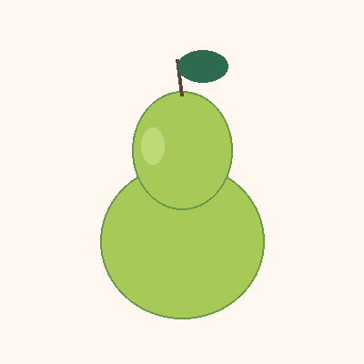 | peer | gpt-image-1-mini | 2026-07-05 | master prompt, subject: "a green-yellow pear with a leaf" (refs: zebra, beer, appel) |
| 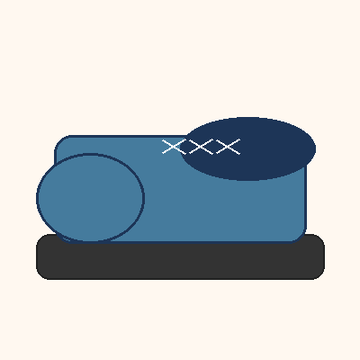 | schoen | gpt-image-1-mini | 2026-07-05 | master prompt, subject: "a child's shoe" (refs: zebra, beer, appel) |
| 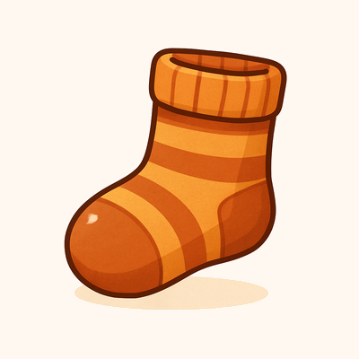 | sok | gpt-image-1-mini | 2026-07-05 | master prompt, subject: "a knitted sock" (refs: zebra, beer, appel) |
| 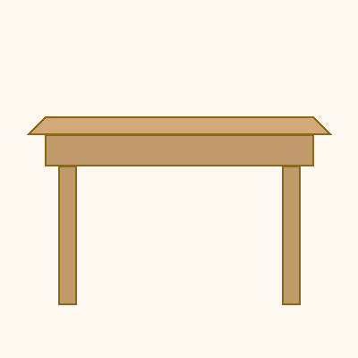 | tafel | gpt-image-1-mini | 2026-07-05 | master prompt, subject: "a long wooden dining table seen straight from the front, much wider than tall" (refs: zebra, beer, appel) |
| 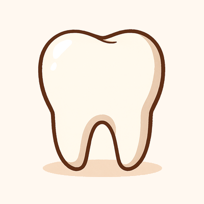 | tand | gpt-image-1-mini | 2026-07-05 | master prompt, subject: "a single white tooth" (refs: zebra, beer, appel) |
| 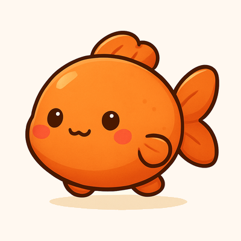 | vis | gpt-image-1-mini | 2026-07-05 | master prompt, subject: "a chubby orange fish" (refs: zebra, beer, appel) |
| 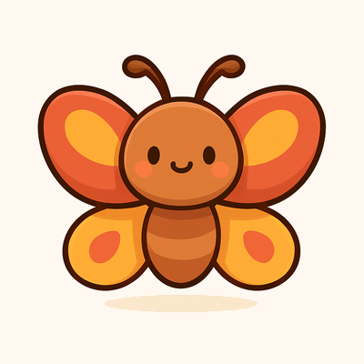 | vlinder | gpt-image-1-mini | 2026-07-05 | master prompt, subject: "a colorful butterfly" (refs: zebra, beer, appel) |
| 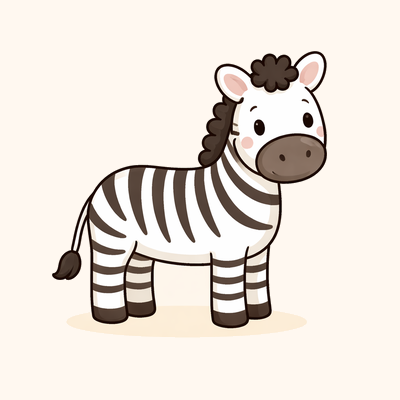 | zebra | ChatGPT/DALL-E | 2026-03-18 | _prompt lost — regenerate from the master prompt if this image ever needs fixing_ |
| 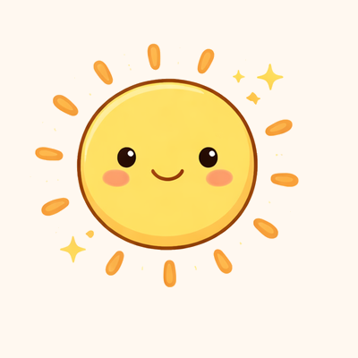 | zon | ChatGPT/DALL-E | 2026-03-19 | _prompt lost — regenerate from the master prompt if this image ever needs fixing_ |
