# Image Sources

This file tracks the source, copyright status, and generation details for all images in `starter-deck/images/`.

**Note:** Personal/private images (family photos etc.) are stored locally in `~/.lettercards/personal/` and are not tracked here.

## License Types

- **ChatGPT/DALL-E**: Per OpenAI's terms, users own the images they create and can use them commercially.
- **Pillow placeholder**: Self-created geometric shapes, no copyright restrictions.

## Images

| Preview | Name | Source | Date | Prompt |
|:-------:|------|--------|------|--------|
| 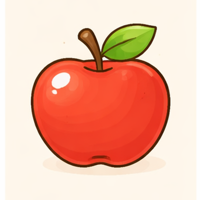 | appel | ChatGPT/DALL-E | 2026-03-19 | |
| 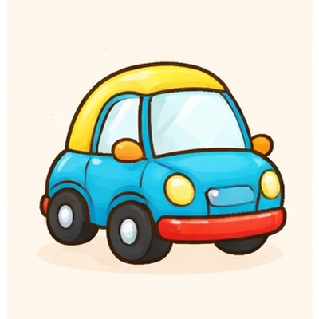 | auto | ChatGPT/DALL-E | 2026-03-19 | |
| 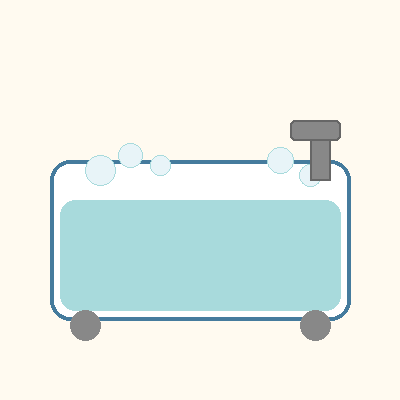 | bad | Pillow placeholder | | |
| 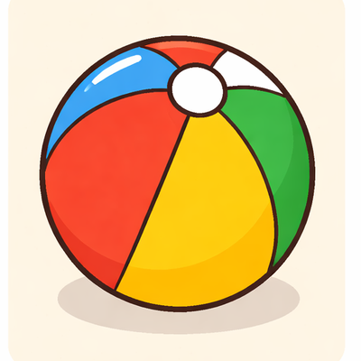 | bal | ChatGPT/DALL-E | 2026-03-19 | Create a 3x1 grid of cute, simple, child-friendly illustration style similar to Dutch children's books like Nijntje (Miffy) or Dikkie Dik. Soft rounded shapes, warm colors, gentle outlines, cream/beige background. The style should be appealing to toddlers (age 2). The 3 items to draw (left to right, top to bottom): banaan, beer, bal. Each item should be in its own cell with a cream/beige background. Keep items centered and recognizable for a toddler. |
| 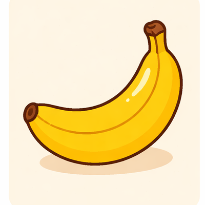 | banaan | ChatGPT/DALL-E | 2026-03-19 | Create a 3x1 grid of cute, simple, child-friendly illustration style similar to Dutch children's books like Nijntje (Miffy) or Dikkie Dik. Soft rounded shapes, warm colors, gentle outlines, cream/beige background. The style should be appealing to toddlers (age 2). The 3 items to draw (left to right, top to bottom): banaan, beer, bal. Each item should be in its own cell with a cream/beige background. Keep items centered and recognizable for a toddler. |
| 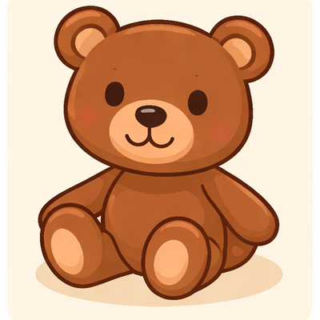 | beer | ChatGPT/DALL-E | 2026-03-19 | Create a 3x1 grid of cute, simple, child-friendly illustration style similar to Dutch children's books like Nijntje (Miffy) or Dikkie Dik. Soft rounded shapes, warm colors, gentle outlines, cream/beige background. The style should be appealing to toddlers (age 2). The 3 items to draw (left to right, top to bottom): banaan, beer, bal. Each item should be in its own cell with a cream/beige background. Keep items centered and recognizable for a toddler. |
| 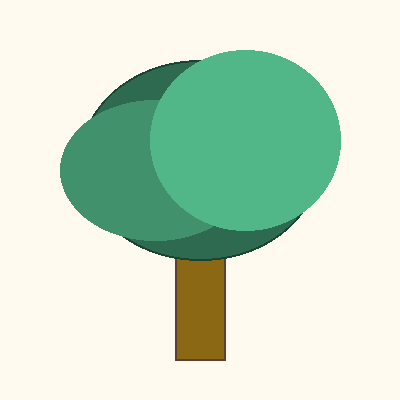 | boom | Pillow placeholder | | |
| 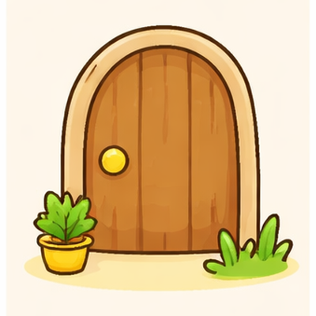 | deur | ChatGPT/DALL-E | 2026-03-19 | |
| 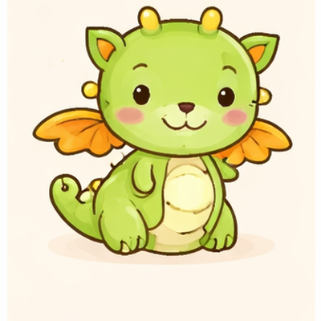 | draak | ChatGPT/DALL-E | 2026-03-19 | |
| 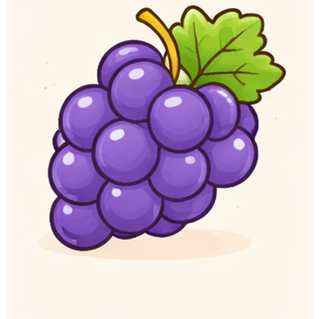 | druif | ChatGPT/DALL-E | 2026-03-19 | |
| 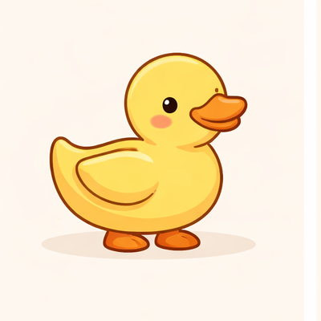 | eend | ChatGPT/DALL-E | 2026-03-19 | |
| 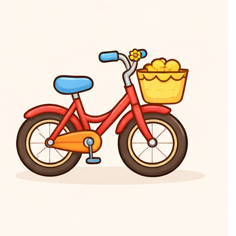 | fiets | ChatGPT/DALL-E | 2026-03-19 | |
| 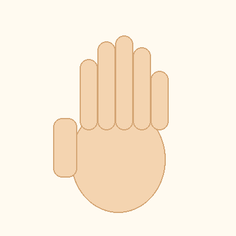 | hand | Pillow placeholder | | |
| 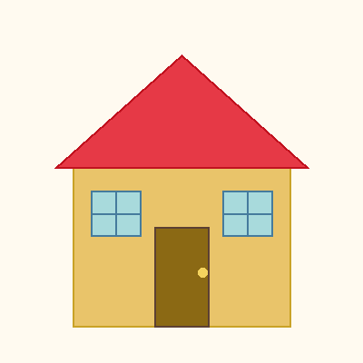 | huis | Pillow placeholder | | |
| 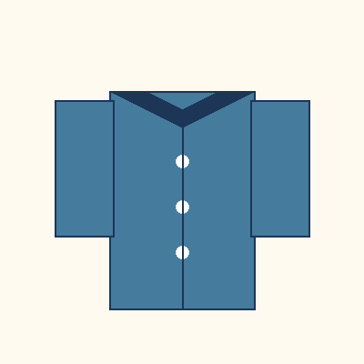 | jas | Pillow placeholder | | |
| 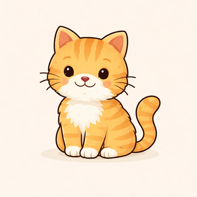 | kat | ChatGPT/DALL-E | 2026-03-18 | |
| 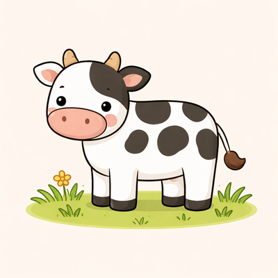 | koe | ChatGPT/DALL-E | 2026-03-18 | |
| 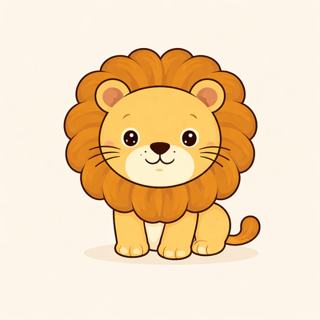 | leeuw | ChatGPT/DALL-E | 2026-03-18 | |
| 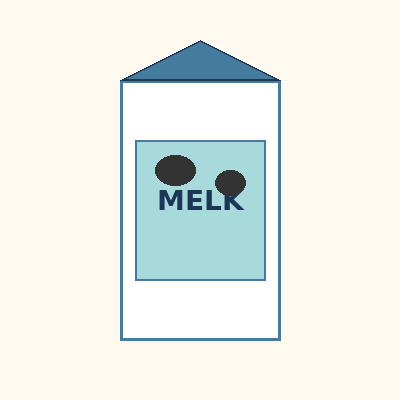 | melk | Pillow placeholder | | |
| 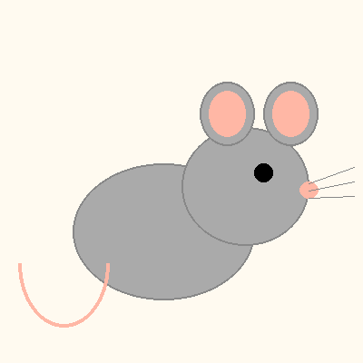 | muis | Pillow placeholder | | |
| 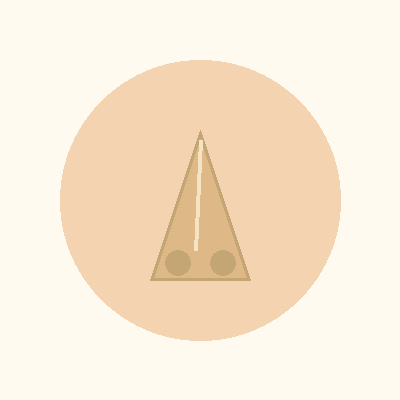 | neus | Pillow placeholder | | |
| 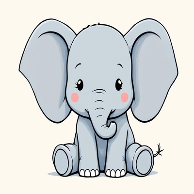 | olifant | ChatGPT/DALL-E | 2026-03-18 | |
| 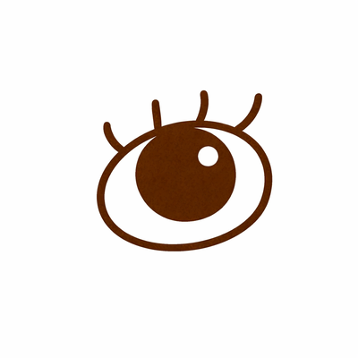 | oog | ChatGPT/DALL-E | 2026-03-22 | Create a cute, simple, child-friendly illustration style similar to Dutch children's books like Nijntje (Miffy) or Dikkie Dik. Soft rounded shapes, warm colors, gentle outlines, pure white (#FFFFFF) background. The style should be appealing to toddlers (age 2). No text, labels, or captions in the image. Draw: oog. Make it centered on a cream/beige background, simple and recognizable for a toddler. |
| 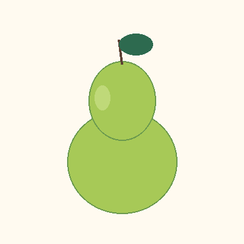 | peer | Pillow placeholder | | |
| 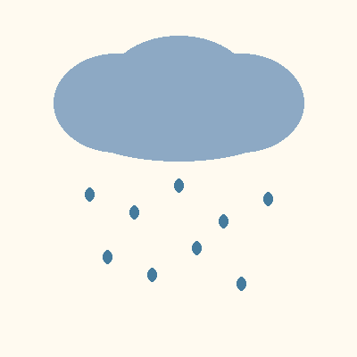 | regen | Pillow placeholder | | |
| 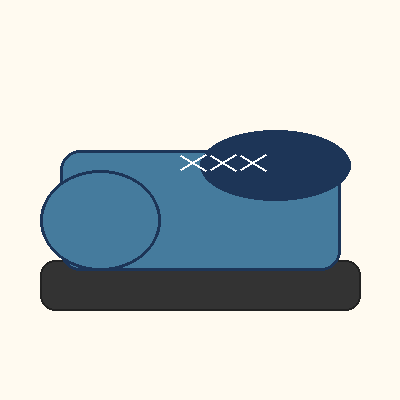 | schoen | Pillow placeholder | | |
| 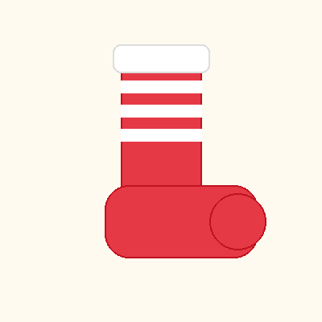 | sok | Pillow placeholder | | |
| 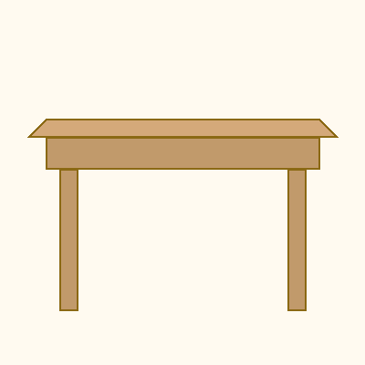 | tafel | Pillow placeholder | | |
| 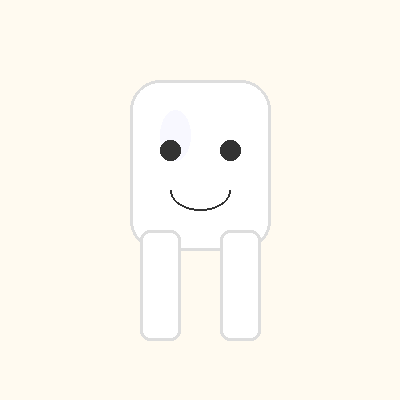 | tand | Pillow placeholder | | |
| 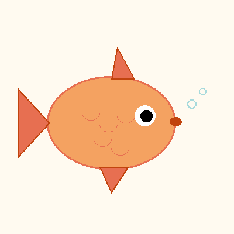 | vis | Pillow placeholder | | |
| 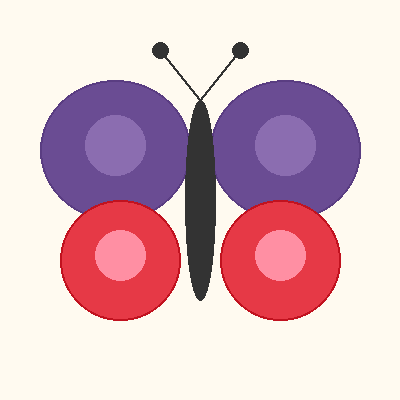 | vlinder | Pillow placeholder | | |
| 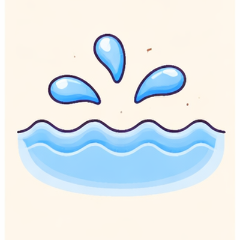 | water | ChatGPT/DALL-E | 2026-03-19 | |
| 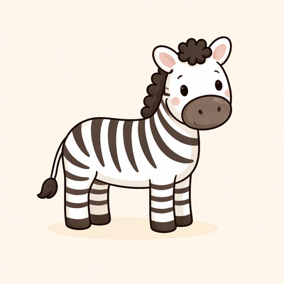 | zebra | ChatGPT/DALL-E | 2026-03-18 | |
| 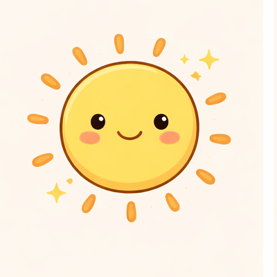 | zon | ChatGPT/DALL-E | 2026-03-19 | |
